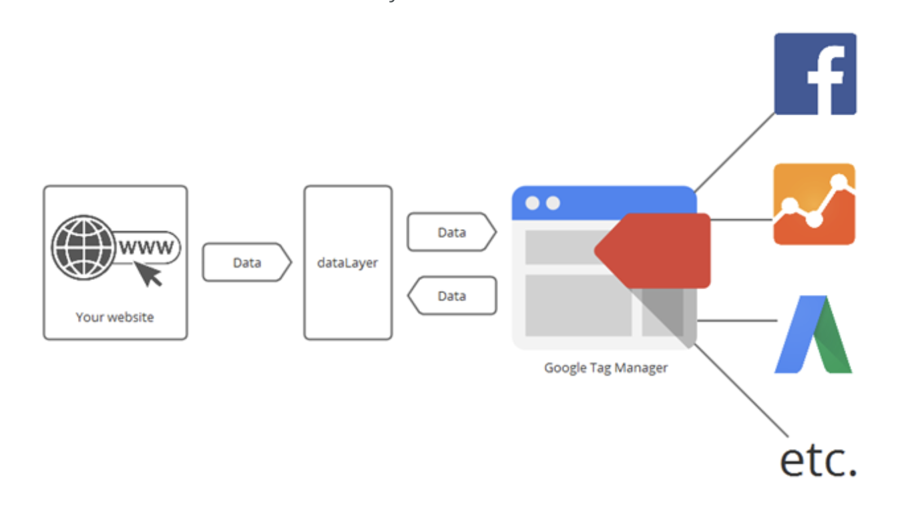

## What is a [data layer](https://developers.google.com/tag-manager/devguide)?

> A data layer (or data object) is that contains all of the information that you want to pass to a tag manager.

### What is a [tag manager](https://en.wikipedia.org/wiki/Google_Tag_Manager)?

- Containers: Use it to contain all the other components using in the tags implementation.
- Triggers: Define when to fire the tags.
- Variables & constants: Collect specific information and pass onto data layer.
- Data layers: A JavaScript object which keeps the information tags separate from other code. [6]

```javascript
// It's just metadata
window.dataLayer = {
  page: {
    id: 1234,
    name: "marketing page",
    category: "B"
  }
};
```

### What problem does it solve?

1.  If VendorA wants event names to be formatted as `PageID + PAGENAME + PAGECATEGORY` and VendorB `pageName.pageId`, both vendors can derive their desired format by knowing the paths to get those values
2.  Reduces maintenance in the frontend codebase to integrate a new partner

### How?

Embed a data layer accessor by including a JavaScript snippet in the `<body>` that observes the `dataLayer` object and pushes updates to a selected tag manager.

- DataLayer can be an object or an array that describes what changed.

### Existing solutions

- [Google Tag Manager](https://developers.google.com/tag-manager/)
- [Adobe Dynamic Tag Manager](https://marketing.adobe.com/resources/help/en_US/dtm/)

### Reference


